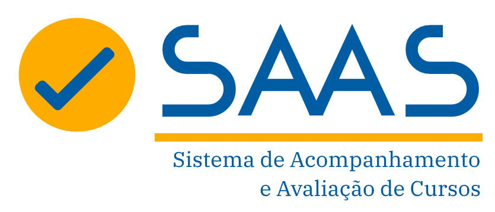

## About 

Course Monitoring and Evaluation System aiming administrative and educational support for institutions within the e-Tec Brasil Network. The Course Monitoring and Evaluation System (SAAS) is a web application developed in Java, using the Spring Framework, Hibernate, and MySQL. The system was developed to be a tool for administrative and educational support for institutions within the e-Tec Brasil Network.

## [Link](https://portal.saas.ufsc.br)

## Status

:ok:

## Authors

- [...](https://portal.saas.ufsc.br/equipe/)
- this[^1]

## Thanks

Sponsored by [UFSC](https://ufsc.br), [FEESC](https://feesc.org.br), and [e-Tec Network](https://portal.mec.gov.br/redes-e-tec-brasil)

## Copyright and license

Code and documentation copyright reserved to the owners and sponsors.

[^1]: https://github.com/vyk1
